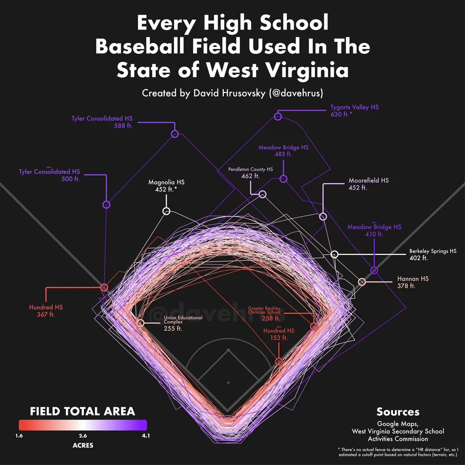

--- 
title: "Maps and Colors"
output: 
  html_document:
    theme: united

---

# Demo Charts - Maps


## Baseball Map
[Every High School Baseball Field used in the State of West Virginia](https://www.reddit.com/r/baseball/comments/zvta0h/oc_every_high_school_baseball_field_used_in_the/)


```{r pressure, echo=FALSE, fig.cap="Baseball Map by ", out.width = '100%'}

```

## Color Scales charts

[Color Scales for disgruntled scientists](https://xkcd.com/2537/) 

[Encoding schema](https://xkcd.com/2864/)