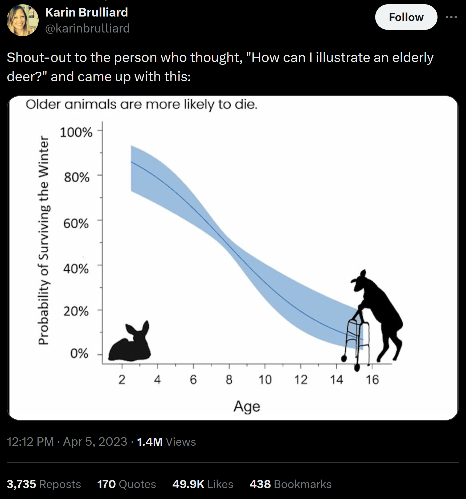

--- 
title: "Effective EDA Reports"
author: "Nathan Garrett, PhD CPA"
date: "Refreshed `r Sys.Date()`"
output: 
  html_document:
    theme: united

---

# Class Exercise

Read the article here: [Is $200k a year good?](https://ofdollarsanddata.com/is-200k-a-year-good/)

Answer the following questions:

- What is the main point of the article?
- What visual techniques make the article effective?
- What rhetorical techniques make the article effective?

# Successful Elements

- Author information (date, name, class, etc...)
- Posting a good question
- Dataset
  - Limitations 
  - Control variables
- Dependent variable
  - Summary stats (mean, median, etc...)
  - Distribution charts
  - By control variables
- Summary
  - One-sentence summary 
  - Limitations
  - Future work

# Good Examples

* [Most Deadly Animals](https://www.gatesnotes.com/Most-Deadly-Animal-Mosquito-Week-2016)
* [The limits of personal experience](https://ourworldindata.org/limits-personal-experience)
* [Is 200k a year good?](https://ofdollarsanddata.com/is-200k-a-year-good/)
* [Generational Wealth](https://ofdollarsanddata.com/generational-wealth/)

# Tips

Make the title match the message in the graph

