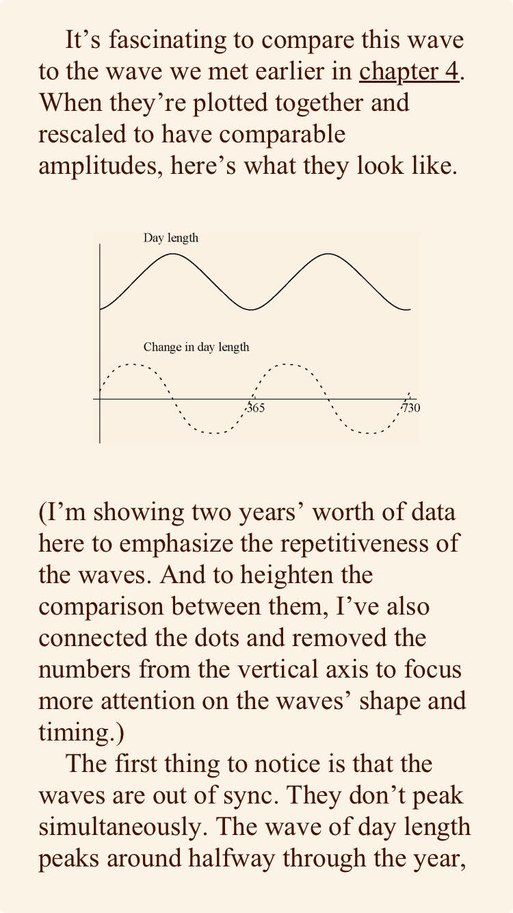

--- 
title: "Data"
author: "Nathan Garrett, PhD CPA"
date: "Refreshed `r Sys.Date()`"
output: 
  html_document:
    theme: united

---

# Why look at data?

Outcomes:

- Identify a pattern underlying data (Vanhove's 16 different data distributions)
- Describe chart-junk
- Differentiate between a cross-sectional and longitudinal data set
- Describe problem with a non-zero vertical axis
- Rank order types of charts based on error rate
- Describe different attributes making things pop (pre-attentive attributes)

Read:

- [Socviz.co Chapter 1](https://socviz.co/lookatdata.html)
- [Optional, Fundamentals of Data Visualization](https://clauswilke.com/dataviz/)

# Measures Differences

