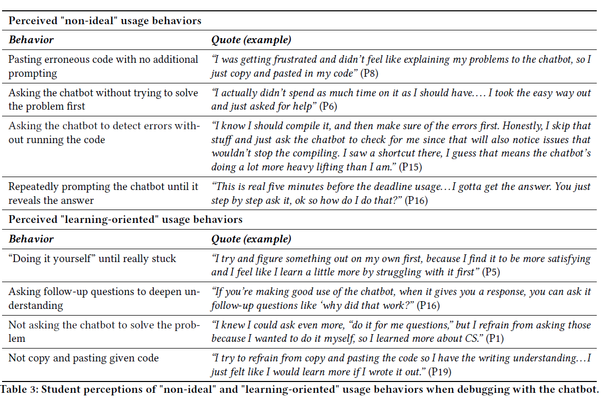

--- 
title: "Learning Philosophy"
author: "Nathan Garrett, PhD CPA"
date: "Refreshed `r Sys.Date()`"
output: 
  html_document:
    theme: united

---

# Traditional passive learning

The traditional approach is:

- Listen while someone lectures
- Read the book 
- Test your recall of knowledge on exam

However, this does not align well with what we've learned about how people learn. 

# Active Learning

Active learning encourages you to take responsibility for your own learning, testing your knowledge against the course outcomes. It looks like this:

- Mini-lecture covering a new skill
- In-class application problem
- On your own homework problem
- Larger project combining multiple skills
- Test with debugging and write-your-own solution to a problem

This probably feels weird. *You will probably feel that you're learning less.* However, this is because students over-rate their learning in passive learning and under-rate it with active learning.  If you want to learn more, see [this website on retrieval practice](https://www.retrievalpractice.org/library). Mastering these skills can improve your ability to learn, especially in skill-based disciplines.

## Mastery of each section's skills

Completely understand each skill before continuing. This is important because your working memory is limited. Most people can hold around 4 *chunks* of information at a time. If you're learning new material, this means that you have to have resources free to focus on them.

Our goal is to learn each set of skills well enough that they become automatic, making space for you to learn new skills. We want to push the new material into long-term learning, where you have essentially an infinite capacity. 

## Spacing Effect

You remember better when spacing your learning out. It is more efficient to study for an hour three times than studying in a single 3-hour block. 

As one study found, students who studies for 30 minutes scored 55% on a test, while those who spread out 3 ten-minute study sessions over separate days scored 75%. [link](https://pdf.retrievalpractice.org/SpacingGuide.pdf)

## Review

A common learning technique is when students re-read a textbook. This *feels* like a good practice, as your brain learns to *recognize* the material.

However, few tests measure your ability to recognize material. Instead, you have to retrieve the correct information. As a result, it's much better to practice doing problems that force you to retrieve the material. This creates a *desirable difficulty* to leads to better growth. See [deliberate practice](https://en.wikipedia.org/wiki/Practice_(learning_method)#Deliberate_practice).

## Testing effect

Preparing and taking tests are one of the best ways to learn! They give feedback on what you've learned, and force you to go back and review what you learned.

# Feeling stuck

Learning to program can be very frustrating! People often respond [with avoidance strategies](https://dl.acm.org/doi/10.1145/3632620.3671119):

## Recognize how you'll feel

- "...I was tired of feeling bad.” 
- “I very quickly gave up doing the homework because I was annoyed with being upset.” 
- “I just don’t really know if I have the patience to go through it and
figure it out sometimes because those negative emotions are hitting
me.” 

### Think about your strategies

Instead of referencing course resources *to find the exact code* start from a *similar example.*

Instead of *trial-and-error strategies*, break a problem into smaller parts and get each part working.
 Trace a problem line-by-line.

Instead of *memorizing syntax*, identify key concepts

"Some students used memorization as
a way to learn programming. While memorization can be beneficial
for recalling syntax, professional programming emphasizes
understanding of principles, the use of problem-solving techniques,
systematic debugging, and adaptive planning in varied contexts. Memorization will not help with these core skills."

### Transfer successes from other classes: 

- Build up your skills

"It started because of my calculus class and I just realized
that everyone was really good at a lot of small
things that built up the algebra... When I’m working
on something very hard, [I ask myself] why can’t
I do this? And usually, it comes down to a lot of very
simple things that add up. "

- Plan your approach 

"From my personal perspective, it makes it easier when
you know what specific tasks you’re going to do instead
of just trying to take on all of it at once. And I
think it’s a little bit like when you’re cooking something,
I think if that’s a good analogy and you read
through the recipe first, you’re not scrambling in the
middle of it to look for maybe you’re missing an ingredient
or [tool]. It saves time in the middle."

## Recognize the role of experience

Asking an experienced person for help can be frustrating:

"I can’t intuitively tell where my problem is. It seems
like some of the TAs just look at your code and they
can intuitively tell, that’s so impressive . . . some of
my friends could even look at some of my code and
be like, I can tell what’s wrong with this ... So clearly
they have some intuitive sense of what is wrong and
what is right."

*It's just that we've seen a thousand errors before!*

# How to use GenAI?

Keep the right level of *desirable difficulty.*

[source](https://fiddlehed.com/blog/fiddling-with-desirable-difficulty/)

Questions:

- Explanation: "I am using R in a data mining course. Explain the ggplot bar chart syntax"
- Debugging: "This R ggplot code should give me bars, but instead has an blank output. What is wrong?"
- Hypothesis/Implementation: "Show me how to add an axis to this R ggplot bar chart so that it starts at zero?"

Compare lazy/dependent behavior against effortful or independent approaches

source: [Debugging with an AI Tutor: Investigating Novice Help-seeking Behaviors and Perceived Learning](https://dl.acm.org/doi/10.1145/3632620.3671092)

For some good examples of how a working professional uses AI, see [this blog post of examples](https://nicholas.carlini.com/writing/2024/how-i-use-ai.html).
