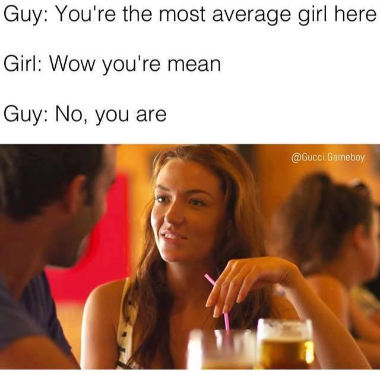

# Statistics in R - Introduction

This corresponds to the DataCamp *Introduction to Statistics in R* course.

It also pulls concepts from [Regression and Other Stories](https://avehtari.github.io/ROS-Examples/), which is a fantastic statistical book.

There are two main branches of statistics

- *Descriptive* describe our data
- *Inferential* uses a sample to predict a population. This focuses on the following 3 generalization problems:
  - from sample to population
  - from treatment to control group
  - from observed measurements to underlying constructs of interest

# Data types:

- Numerical
  - *Continuous data*'s precision is set by the measuring tool, not the underlying value. A good example is height or weight.
  - *Discrete data* has no intermediate values, such as ranks or number of classes completed
- *Categorical* is generally text (though it can be stored as a number, such as K-12)
  - Can have order (such as freshman/.../senior) or not (majors)

# Measures

- Measures of central tendency
  - Mean, median, mode
  - Skew
- Measures of spread
  - Variance: difference between mean and each data point, squared.
  - Standard deviation: square root of variance
  - Mean absolute deviation: similar to standard deviation ,but not square that causes longer distances to have more of a penalty.
  - Quartiles: data split into 4 categories
  - Quantiles: data split into 10 categories
  - Interquartile range (IQR): difference between 25% and 75% percentile.
- Outliers: anything less than 25th quartile less 1.5 IQR (or 75% quartile + 1.5 IQR)

  

# Distributions

## Normal distribution

- Describe the concept of a normal distribution
- Describe why having a normal distribution is useful
- List some items having (or not) a normal distribution

*3-minute data science* "Normal distribution": https://www.youtube.com/watch?v=3VYupIsbLlY

## Uniform

All outcomes have an equal probability.

Use `runif`

## Binomial

An outcome with either true or false (1 or 0).

Use `rbinom`

# Probability

- Sampling with and without replacement
- Independent and dependent events
- Probability distribution
  - Discrete: rolling a dice
  - Continuous: bus delay

## Correlation 

Outcomes:

- Describe the role of a correlation
- Know the difference between the statistical significant of a correlation, versus its strength.
- Magnitude
  - Strong > 50, moderate >25, weak around 20%.
  - Understand negative versus positive sign
- Problems
  - Non-linear relationships.
    - Can have log applied
  - Correlation v. causation v. confounding 
  

Help: https://www.youtube.com/watch?v=rijqfllOq6g

[Good discussion and examples of correlation](https://www.reddit.com/r/dataisbeautiful/comments/18p85yp/correlating_four_other_variables_with_a_states/?share_id=IsERBPtlNN-F0Bw9s0kSn)

# Experiment

Controlled experiment

- Control group
- Treatment / experimental group
- Double-blind
- Selection
  - Random 
  - Observational
- Time
  - Longitudinal
  - Cross-sectional
